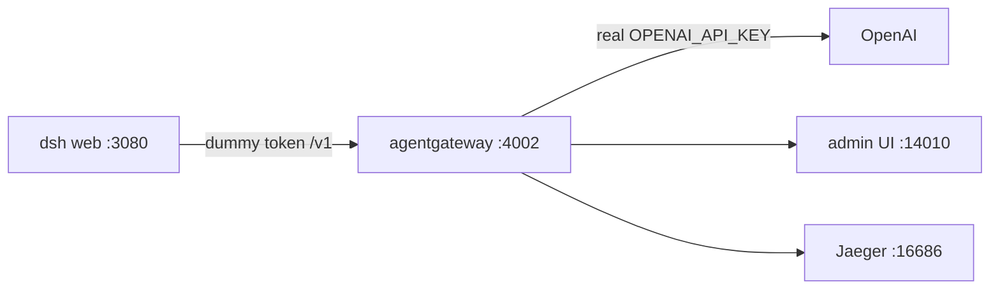

# deepseek-agw

This is the setup we actually ran: **standalone** agentgateway in front of local DeepSeek Harness.

`dsh` is a local agent UI. I put the gateway in the middle so the UI never sees the real OpenAI key. Harness talks to `http://127.0.0.1:4002/v1` with a dummy token. The gateway is the only process that holds `OPENAI_API_KEY`. Token stats, USD cost, and Jaeger traces live there.

Same pattern later for MCP — not wired in this first pass. Same pattern on Kubernetes is a shorter follow-up, not this story: [docs/kubernetes.md](docs/kubernetes.md).

## Architecture



The key is not in GitHub, not in `$DSH_HOME`, and not in the harness process. A mode-600 file is sourced by `start-agw.sh` and exported into the gateway process only. Sample config is [`agentgateway.yaml`](agentgateway.yaml) — `$OPENAI_API_KEY` placeholder, no secret.

## Commands

This is what I typed on the box. agentgateway **1.4.1**. Node **24** — Node 20 is too old for current `dsh`.

Node 24:

```
nvm install 24
nvm use 24
node -v
```

Gateway + `agctl`, pinned:

```
curl -sL https://agentgateway.dev/install | bash -s -- --version v1.4.1
agentgateway --version
```

Cost catalog (once). Lands in `config.modelCatalog`:

```
mkdir -p costs
agctl costs import --source models.dev --providers openai --out ./costs/catalog.json
```

Jaeger all-in-one:

```
docker run -d --name jaeger \
  -e COLLECTOR_OTLP_ENABLED=true \
  -p 16686:16686 \
  -p 4317:4317 \
  -p 4318:4318 \
  jaegertracing/all-in-one:latest
```

Real key in a 600 file. Do not commit it. Do not put it in the yaml.

```
mkdir -p .secrets
umask 077
printf 'export OPENAI_API_KEY=sk-...\n' > .secrets/openai.env
chmod 600 .secrets/openai.env
```

Start the gateway. `OPENAI_API_KEY` is in this process only.

```
./start-agw.sh
```

Admin UI: http://127.0.0.1:14010/ui · costs: http://127.0.0.1:14010/ui/llm/costs · LLM listener `:4002` · metrics `:14030`.

Harness, dummy token — not the OpenAI key:

```
export GATEWAY_API_KEY=local-harness-not-openai
npx @deepseek-ai/dsh web
```

UI is http://127.0.0.1:3080. Pointing harness at the gateway is the next section. Required.

## Configure DeepSeek Harness with agentgateway

This is the wiring. Skip it and the first turn hits `deepseek-official` with no `DEEPSEEK_API_KEY`, or `gpt-4o` with `maxTokens` 32768 and a 400.

Gateway is already up. Real OpenAI key is only in the agentgateway process env. Confirm the admin UI at http://127.0.0.1:14010/ui and the costs page at http://127.0.0.1:14010/ui/llm/costs before you touch harness.

Captions match the standalone box we actually ran. No real API key is on screen. PNG stills belong in [`docs/shots/`](docs/shots/) under the names below. GIFs for the same flow are reserved — this launch is stills only.

### UI — http://127.0.0.1:3080

1. Open the harness UI. **New Session**. Pick **agentgateway / gpt-4o**. Do not pick `deepseek-official`.

   The picker groups DeepSeek models separately from the custom provider. The one we used is labeled `agentgateway (OpenAI via dummy token)`. `gpt-4o` is selected.

   

2. **Settings → Models**. Enter API keys for the providers you want. DeepSeek stays red here — there is no `DEEPSEEK_API_KEY` on this box. The custom agentgateway row is green.

   

3. **Add a custom provider**, or edit the one already in `$DSH_HOME/settings.yaml`. Fill the form. Dummy token only.

   - Provider ID in `$DSH_HOME/settings.yaml`: `agw`
   - Display name in the UI: `agentgateway (OpenAI via dummy token)`
   - API protocol: `openai-completions`
   - Base URL: `http://127.0.0.1:4002/v1`
   - apiKeyEnv: `GATEWAY_API_KEY`
   - Key value: `local-harness-not-openai` — **not** the real OpenAI key

   

4. Add models. At least `gpt-4o` and `gpt-4o-mini`. Set **max output tokens to 8192** (16384 also works). The harness default is 32768. That default makes `gpt-4o` return 400 (max completion tokens 16384).

   

5. Two short turns so you can see it work. Session title on this box was "Simple Arithmetic Query".

   - "What is 2+2? Reply with just the number." → `4`
   - "Name the capital of France in one word." → `Paris`

   

6. Open the gateway admin. Analytics and Logs are how you confirm the dummy-token path actually hit OpenAI.

   Analytics — http://127.0.0.1:14010/ui — "Analyze LLM traffic by model, user, and provider." This run: **39 tokens / 2 calls**.

   

   Logs — inspect the two `CHAT` / `200` rows. Model routing shows `gpt-4o-mini` → `gpt-4o-mini-2024-07-18`, provider `openai`. No key on this page.

   

### Files — `$DSH_HOME` (usually `~/.dsh`)

The UI writes here. You can edit the same files by hand.

`$DSH_HOME/settings.yaml` — provider and model caps. No OpenAI key.

```
llm-pi-ai:
  providers:
    agw:
      apiKeyEnv: GATEWAY_API_KEY
      api: openai-completions
      baseURL: http://127.0.0.1:4002/v1
      models:
        - id: gpt-4o
          maxTokens: 8192
        - id: gpt-4o-mini
          maxTokens: 8192
```

`$DSH_HOME/.credentials.yaml` — dummy token only. The Models page stores `GATEWAY_API_KEY` = `local-harness-not-openai` here (write-only in the UI). That is not `OPENAI_API_KEY`. Do not put the real key in `$DSH_HOME`.

If you exported `GATEWAY_API_KEY` before `npx @deepseek-ai/dsh web`, harness can resolve the env instead. Same dummy. Same rule.

## The one gotcha

1. Default `maxTokens` is 32768. `gpt-4o` returns **400** above 16384 completion tokens. Use 16384 or 8192.
2. First UI turn used `deepseek-official`. There is no `DEEPSEEK_API_KEY` here. **New Session** → `agw` / `gpt-4o`.

## Where to look

- Harness UI: http://127.0.0.1:3080
- Harness settings: `$DSH_HOME/settings.yaml` (usually `~/.dsh/settings.yaml`)
- Harness dummy token: `$DSH_HOME/.credentials.yaml` — dummy only
- agentgateway admin: http://127.0.0.1:14010/ui
- Analytics: http://127.0.0.1:14010/ui (LLM → Analytics)
- Logs: http://127.0.0.1:14010/ui (LLM → Logs)
- Costs: http://127.0.0.1:14010/ui/llm/costs
- Jaeger: http://127.0.0.1:16686
- OpenAI-compat listener: http://127.0.0.1:4002/v1
- Metrics: http://127.0.0.1:14030

## Screenshots / GIFs

The configure section above is the walkthrough. Same reserved stills in [`docs/shots/`](docs/shots/):

| File | What |
| --- | --- |
| `docs/shots/harness-model-picker.png` | Model picker — `gpt-4o` on `agentgateway (OpenAI via dummy token)` |
| `docs/shots/harness-settings.png` | Settings → Models list |
| `docs/shots/harness-settings-detail.png` | Base URL `http://127.0.0.1:4002/v1`, protocol `openai-completions`, dummy key |
| `docs/shots/harness-models-max-tokens.png` | Catalog — `gpt-4o` max output tokens **8192** |
| `docs/shots/harness-run.png` | Two-question run: `4` and `Paris` |
| `docs/shots/agw-ui.png` | agentgateway Analytics — 39 tokens / 2 calls |
| `docs/shots/agw-logs.png` | agentgateway Logs — two `CHAT` / `200` rows |

GIFs were not recorded this launch. Reserved names if you drop clips later:

- `docs/shots/harness-run.gif` — New Session, pick agentgateway / `gpt-4o`, a turn
- `docs/shots/agw-costs.gif` — http://127.0.0.1:14010/ui/llm/costs

Standalone only. No cluster screenshots. No real API key in any still.

## What this is not

MCP is not wired. Same gateway pattern later. The sample yaml has `$OPENAI_API_KEY` only — no real key in this repo. Kubernetes is the same idea with a Secret instead of a 600 file; that page is shorter on purpose.
