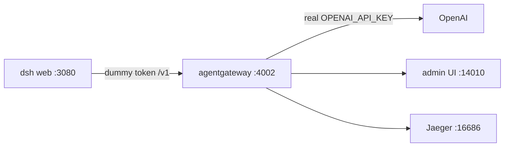
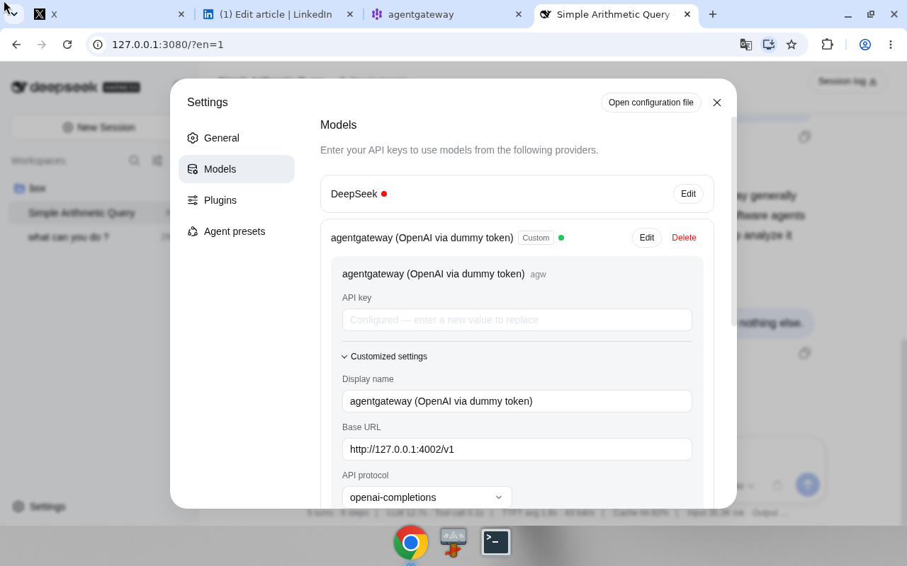
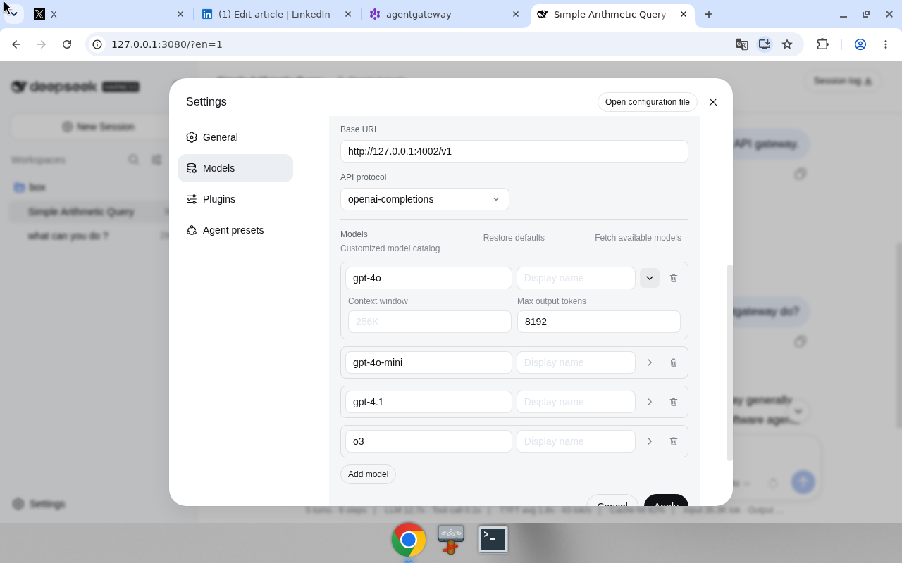
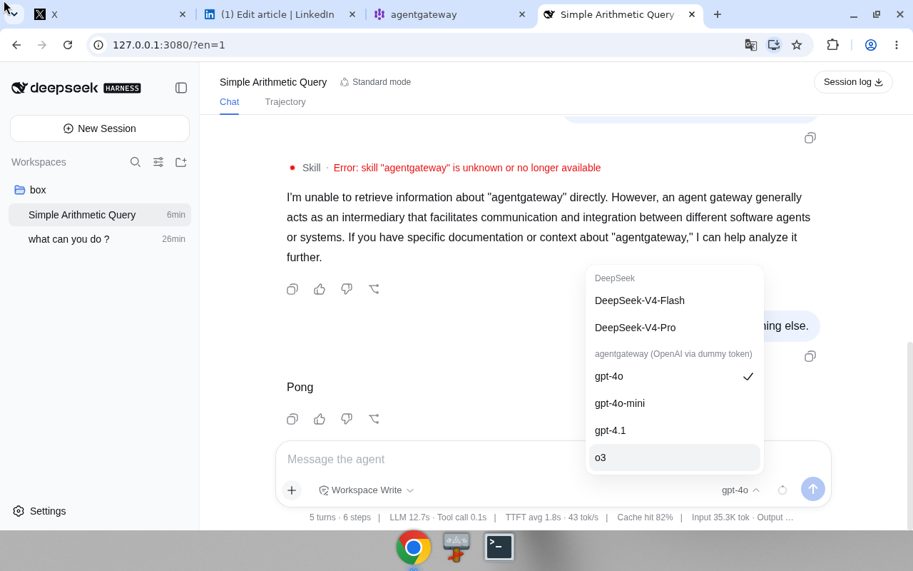
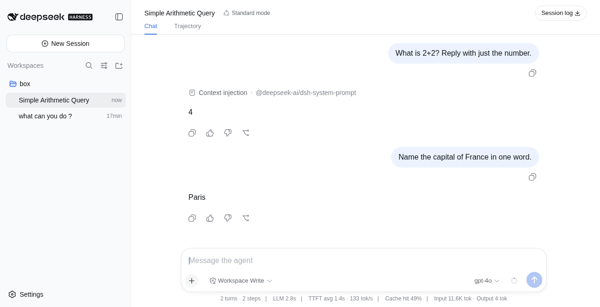
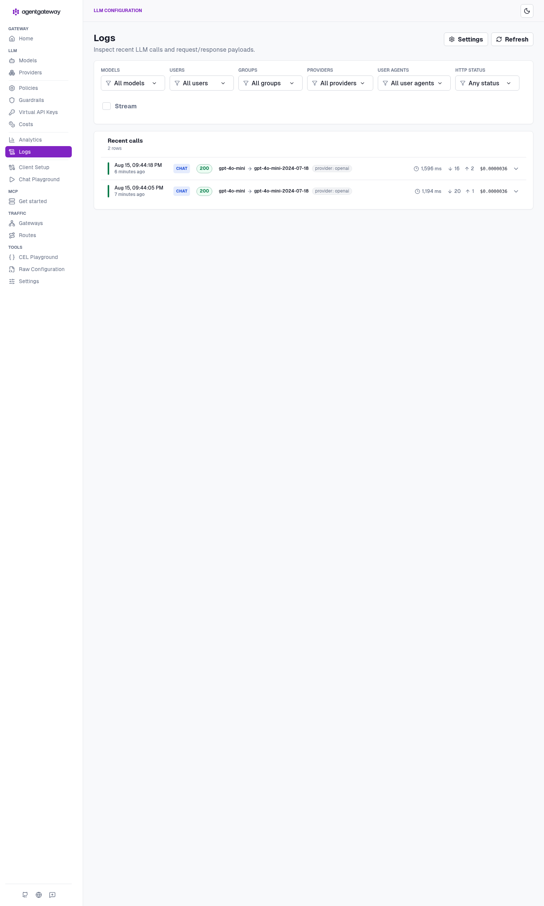

# DeepSeek Harness + agentgateway

Run **standalone agentgateway** in front of **DeepSeek Harness** (`dsh`), so the agent UI never sees your real OpenAI key.

Harness talks to `http://127.0.0.1:4002/v1` with a token you invent. The gateway is the only process that holds `OPENAI_API_KEY`, and because every call passes through it, it is also the one place that can **govern, secure, route, log, and cost** the traffic Harness produces. This is the setup we actually ran on one box — no cluster required.

| Job | Where it lives |
| --- | --- |
| **Govern** | Virtual keys, a token rate limit — [`agentgateway-governed.yaml`](agentgateway-governed.yaml), [Step 8](#step-8-turn-on-governance) |
| **Secure** | Real key in the gateway process only; prompt guards reject secrets on the way out |
| **Route** | `llm.models` maps what Harness asks for onto a provider and model version |
| **Log** | Admin UI → Logs, every call with its status and resolved model |
| **Cost** | Cost catalog turns tokens into dollars, attributed per virtual key |

<p align="center">
  
</p>

## How it works



| Piece | Holds the real key? | What it does |
| --- | --- | --- |
| DeepSeek Harness (`:3080`) | No — dummy token | Agent UI. Speaks OpenAI-compatible to the gateway. |
| agentgateway (`:4002`) | **Yes** — process env only | Injects the real key, meters tokens and cost, emits traces. |
| Admin UI (`:14010`) | No | Analytics, Logs, and Costs for the traffic above. |
| Jaeger (`:16686`) | No | OTLP traces from the gateway. |

The key is not in GitHub, not in `$DSH_HOME`, and not in the harness process. A mode-600 file is sourced by [`start-agw.sh`](start-agw.sh) and exported into the gateway process only. The sample [`agentgateway.yaml`](agentgateway.yaml) carries a `$OPENAI_API_KEY` placeholder — no secret.

## Before you begin

You need:

- **Node 24.** Node 20 is too old for current `dsh`.
- **agentgateway 1.4.1** and `agctl`, pinned.
- **Docker**, for Jaeger all-in-one (optional — skip [Step 3](#step-3-start-jaeger-optional) if you don't want traces).
- An **OpenAI API key** you are willing to put in a local mode-600 file.

Install Node 24:

```bash
nvm install 24
nvm use 24
node -v
```

Install the gateway and `agctl`, pinned to the version this guide was written against:

```bash
curl -sL https://agentgateway.dev/install | bash -s -- --version v1.4.1
agentgateway --version
```

## Step 1: Import the cost catalog

Do this once. It lands in `config.modelCatalog` and is what turns raw token counts into USD on the Costs page.

```bash
mkdir -p costs
agctl costs import --source models.dev --providers openai --out ./costs/catalog.json
```

## Step 2: Store the OpenAI key outside the repo

The real key goes in a mode-600 file. Do not commit it. Do not put it in the YAML.

```bash
mkdir -p .secrets
umask 077
printf 'export OPENAI_API_KEY=sk-...\n' > .secrets/openai.env
chmod 600 .secrets/openai.env
```

> **Note:** `start-agw.sh` refuses to start if this file is missing or if `OPENAI_API_KEY` is empty after sourcing it.

## Step 3: Start Jaeger (optional)

The sample config ships traces to `http://localhost:4317`. Bring up Jaeger all-in-one to receive them:

```bash
docker run -d --name jaeger \
  -e COLLECTOR_OTLP_ENABLED=true \
  -p 16686:16686 \
  -p 4317:4317 \
  -p 4318:4318 \
  jaegertracing/all-in-one:latest
```

Jaeger UI: <http://127.0.0.1:16686>

## Step 4: Start the gateway

```bash
./start-agw.sh
```

`OPENAI_API_KEY` now exists in this process and nowhere else. Confirm the gateway is up before you touch Harness:

| Endpoint | URL |
| --- | --- |
| Admin UI | <http://127.0.0.1:14010/ui> |
| Costs | <http://127.0.0.1:14010/ui/llm/costs> |
| OpenAI-compat listener | `http://127.0.0.1:4002/v1` |
| Metrics | <http://127.0.0.1:14030> |

## Step 5: Start DeepSeek Harness

Export the **dummy** token — not the OpenAI key — and start the UI:

```bash
export GATEWAY_API_KEY=local-harness-not-openai
npx @deepseek-ai/dsh web
```

Harness UI: <http://127.0.0.1:3080>

> **Important:** Don't send a turn yet. Out of the box the first turn hits `deepseek-official` with no `DEEPSEEK_API_KEY`, or `gpt-4o` with `maxTokens` 32768 and a 400. Step 6 is the wiring that fixes both.

## Step 6: Point Harness at the gateway

Configure this in the UI at <http://127.0.0.1:3080>. (Prefer editing files? See [Configure by file](#configure-by-file-instead).)

### 1. Open **Settings → Models**

Enter API keys for the providers you want. DeepSeek stays red — there is no `DEEPSEEK_API_KEY` on this box. The custom agentgateway row is green.


### 2. Add a custom provider

Add one, or edit the entry already in `$DSH_HOME/settings.yaml`. Dummy token only.

| Field | Value |
| --- | --- |
| Provider ID (in `settings.yaml`) | `agw` |
| Display name | `agentgateway (OpenAI via dummy token)` |
| API protocol | `openai-completions` |
| Base URL | `http://127.0.0.1:4002/v1` |
| `apiKeyEnv` | `GATEWAY_API_KEY` |
| Key value | `local-harness-not-openai` — **not** the real OpenAI key |



### 3. Add models and cap max output tokens

Add at least `gpt-4o` and `gpt-4o-mini`, and set **max output tokens to 8192** (16384 also works).

> **Warning:** The Harness default is 32768. That default makes `gpt-4o` return **400** — its ceiling is 16384 completion tokens.



### 4. Start a new session on the gateway provider

**New Session** → pick **agentgateway / gpt-4o**. Do not pick `deepseek-official`. The picker groups the DeepSeek models separately from the custom provider, which is labeled `agentgateway (OpenAI via dummy token)`.



## Step 7: Verify the traffic

Send two short turns so there is something to look at. The session on this box was titled "Simple Arithmetic Query":

- `What is 2+2? Reply with just the number.` → `4`
- `Name the capital of France in one word.` → `Paris`



Now open the gateway admin at <http://127.0.0.1:14010/ui>. **Analytics** and **Logs** are how you confirm the dummy-token path actually reached OpenAI.

**Analytics** — "Analyze LLM traffic by model, user, and provider." This run: **39 tokens / 2 calls**, $0.0000072.


**Logs** — inspect the two `CHAT` / `200` rows. Model routing shows `gpt-4o-mini` → `gpt-4o-mini-2024-07-18`, provider `openai`. No key on this page.



## Configure by file instead

The UI writes to `$DSH_HOME` (usually `~/.dsh`). You can edit the same files by hand.

**`$DSH_HOME/settings.yaml`** — provider and model caps. No OpenAI key:

```yaml
llm-pi-ai:
  providers:
    agw:
      apiKeyEnv: GATEWAY_API_KEY
      api: openai-completions
      baseURL: http://127.0.0.1:4002/v1
      models:
        - id: gpt-4o
          maxTokens: 8192
        - id: gpt-4o-mini
          maxTokens: 8192
```

**`$DSH_HOME/.credentials.yaml`** — dummy token only. The Models page stores `GATEWAY_API_KEY` = `local-harness-not-openai` here (write-only in the UI). That is not `OPENAI_API_KEY`.

> **Warning:** Never put the real OpenAI key in `$DSH_HOME`. If you exported `GATEWAY_API_KEY` before running `npx @deepseek-ai/dsh web`, Harness resolves it from the env instead. Same dummy, same rule.

## Troubleshooting

| Symptom | Cause | Fix |
| --- | --- | --- |
| `gpt-4o` returns **400** | `maxTokens` defaults to 32768; `gpt-4o` caps completion tokens at 16384 | Set max output tokens to 16384 or 8192 |
| First turn fails on a missing key | The session is on `deepseek-official`, and there is no `DEEPSEEK_API_KEY` on this box | **New Session** → `agw` / `gpt-4o` |
| `missing .secrets/openai.env` on start | The mode-600 key file doesn't exist | Redo [Step 2](#step-2-store-the-openai-key-outside-the-repo) |
| No rows in Analytics or Logs | Harness is still talking to a DeepSeek provider | Recheck the base URL in [Step 6](#step-6-point-harness-at-the-gateway) |
| Every call returns **401/403** after Step 8 | `apiKey.mode: strict` and Harness is still sending the old token | Put `$DSH_VIRTUAL_KEY` in `GATEWAY_API_KEY` |
| A normal prompt returns **400 content_policy_violation** | A prompt guard matched — the `email` builtin is easy to trip | Loosen the rules in `agentgateway-governed.yaml` |

## Step 8: Turn on governance

Steps 1–7 get the key out of the app and put a number on the traffic. That covers secure, route, log, and cost. What's missing is **govern** — nothing yet decides *who* may call, how much they may spend, or what may be sent.

[`agentgateway-governed.yaml`](agentgateway-governed.yaml) is the same config with three additions:

| Addition | What it does |
| --- | --- |
| `llm.policies.apiKey` (`mode: strict`) | Unrecognized tokens are rejected. Recognized ones carry `user: dsh` onto the cost page. |
| `llm.policies.localRateLimit` | 200k tokens/hour, gateway-wide. A ceiling an agent in a loop cannot argue with. |
| `guardrails.request.regex` | Rejects prompts containing an API key, an `sk-` string, or an email before they leave the box. |

The token Harness sends stops being arbitrary and becomes a **virtual key** — still not an OpenAI key, still useless anywhere else, but now recognized and attributed. Pick a value and add it to the same mode-600 file:

```bash
printf 'export DSH_VIRTUAL_KEY=sk-dsh-local-harness\n' >> .secrets/openai.env
```

Restart against the governed config:

```bash
AGW_CONFIG=./agentgateway-governed.yaml ./start-agw.sh
```

Then update Harness to send that value instead of the old placeholder — **Settings → Models → agentgateway → API key**, or the env before `npx`:

```bash
export GATEWAY_API_KEY=sk-dsh-local-harness
npx @deepseek-ai/dsh web
```

Nothing else about Harness changes. That is the point of putting the control point outside the app.

> **Note:** `start-agw.sh` scans the config for `$VAR` references and refuses to start if one is empty, so a missing `DSH_VIRTUAL_KEY` fails loudly instead of booting a gateway that rejects every request.

Two things worth knowing before you rely on this. The rate limit is **gateway-wide** on standalone, not per key — per-key daily budgets need a remote rate-limit server. And `tokenize: true` counts the prompt before OpenAI sees it, so an oversized turn is refused without spending anything.

## Reference

**Endpoints**

| What | Where |
| --- | --- |
| Harness UI | <http://127.0.0.1:3080> |
| agentgateway admin | <http://127.0.0.1:14010/ui> |
| Analytics | <http://127.0.0.1:14010/ui> (LLM → Analytics) |
| Logs | <http://127.0.0.1:14010/ui> (LLM → Logs) |
| Costs | <http://127.0.0.1:14010/ui/llm/costs> |
| Jaeger | <http://127.0.0.1:16686> |
| OpenAI-compat listener | `http://127.0.0.1:4002/v1` |
| Metrics | <http://127.0.0.1:14030> |

**Files**

| What | Where |
| --- | --- |
| Gateway config (no secret) | [`agentgateway.yaml`](agentgateway.yaml) |
| Same, with governance | [`agentgateway-governed.yaml`](agentgateway-governed.yaml) |
| Gateway launcher | [`start-agw.sh`](start-agw.sh) — `AGW_CONFIG` picks the config |
| Kubernetes manifests | [`k8s/`](k8s/) — see [`k8s/README.md`](k8s/README.md) |
| Real OpenAI key + virtual key (mode 600, never committed) | `.secrets/openai.env` |
| Harness provider + model caps | `$DSH_HOME/settings.yaml` (usually `~/.dsh/settings.yaml`) |
| Harness token — dummy or virtual key, never the OpenAI key | `$DSH_HOME/.credentials.yaml` |

**Captures** — all stills and clips live in [`docs/shots/`](docs/shots/), keyed to the steps above:

| File | What |
| --- | --- |
| `harness-run.gif` | New Session, pick agentgateway / `gpt-4o`, a turn |
| `harness-settings.png` | Settings → Models list |
| `harness-settings-detail.png` | Base URL `http://127.0.0.1:4002/v1`, protocol `openai-completions`, dummy key |
| `harness-models-max-tokens.png` | Catalog — `gpt-4o` max output tokens **8192** |
| `harness-model-picker.png` | Model picker — `gpt-4o` on `agentgateway (OpenAI via dummy token)` |
| `harness-run.png` | Two-question run: `4` and `Paris` |
| `agw-ui.png` | agentgateway Analytics — 39 tokens / 2 calls |
| `agw-costs.gif` | Admin UI — Analytics and cost totals for the run |
| `agw-logs.png` | agentgateway Logs — two `CHAT` / `200` rows |

Standalone only. No cluster screenshots. No real API key in any capture.

## Next steps

- **Kubernetes** — same pattern, with a Secret instead of a mode-600 file. Manifests are in [`k8s/`](k8s/); the walkthrough is [docs/kubernetes.md](docs/kubernetes.md). Untested — we did not stand a cluster up for this repo.

  ```bash
  ./k8s/install.sh   # Gateway API + agentgateway charts, Secret, cost catalog, manifests
  ```

- **MCP** — not wired in this first pass. Same gateway in the middle, later.
