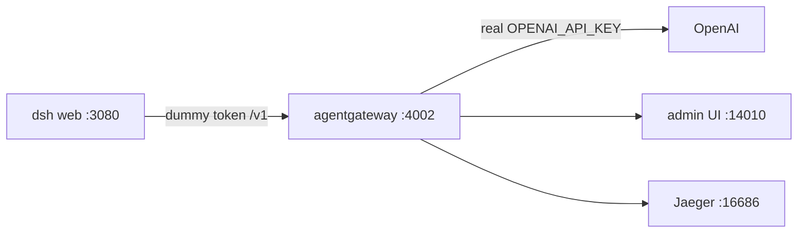

# deepseek-agw

DeepSeek Harness (`dsh`) is a local agent UI. I put standalone **agentgateway** in front of it so the UI never sees the real OpenAI key.

Harness talks to `http://127.0.0.1:4002/v1` with a dummy token. The gateway is the only process that holds `OPENAI_API_KEY`. Token stats, USD cost, and Jaeger traces live there. Same pattern later for MCP — not wired in this first pass.

## Architecture



The key is not in GitHub, not in `$DSH_HOME`, and not in the harness process. A mode-600 file is sourced by `start-agw.sh` and exported into the gateway process only.

## Commands

This is what I typed on the box. agentgateway **1.4.1**. Node **24** — Node 20 is too old for current `dsh`.

Node 24:

```
nvm install 24
nvm use 24
node -v
```

Gateway + `agctl`, pinned:

```
curl -sL https://agentgateway.dev/install | bash -s -- --version v1.4.1
agentgateway --version
```

Cost catalog (once). Lands in `config.modelCatalog`:

```
mkdir -p costs
agctl costs import --source models.dev --providers openai --out ./costs/catalog.json
```

Jaeger all-in-one:

```
docker run -d --name jaeger \
  -e COLLECTOR_OTLP_ENABLED=true \
  -p 16686:16686 \
  -p 4317:4317 \
  -p 4318:4318 \
  jaegertracing/all-in-one:latest
```

Real key in a 600 file. Do not commit it. Do not put it in the yaml.

```
mkdir -p .secrets
umask 077
printf 'export OPENAI_API_KEY=sk-...\n' > .secrets/openai.env
chmod 600 .secrets/openai.env
```

Start the gateway (sample config is [`agentgateway.yaml`](agentgateway.yaml)):

```
./start-agw.sh
```

Admin UI is `http://127.0.0.1:14010/ui`. LLM listener `:4002`. Metrics `:14030`.

Harness, dummy token — not the OpenAI key:

```
export GATEWAY_API_KEY=local-harness-not-openai
npx @deepseek-ai/dsh web
```

UI is `http://127.0.0.1:3080`.

In the harness: **Settings → Models → Add a custom provider**.

- Provider ID: `agw`
- API: `openai-completions`
- baseURL: `http://127.0.0.1:4002/v1`
- apiKeyEnv: `GATEWAY_API_KEY` (the dummy above)
- per-model `maxTokens`: **16384 or less**

## The one gotcha

Two things burned the first turn.

1. Default `maxTokens` is 32768. `gpt-4o` returns **400** if you ask for more than 16384 completion tokens. Set each model to 16384 or less.
2. First UI turn used `deepseek-official` and there is no `DEEPSEEK_API_KEY` here. Pick the **agentgateway** model (`agw`), not the built-in DeepSeek card.

## Where to look

- Harness UI: http://127.0.0.1:3080
- agentgateway admin: http://127.0.0.1:14010/ui
- Costs: http://127.0.0.1:14010/ui/llm/costs
- Jaeger: http://127.0.0.1:16686
- OpenAI-compat listener: http://127.0.0.1:4002/v1
- Metrics: http://127.0.0.1:14030

## GIFs

A 5-question run will be recorded next. Drop the clips in [`docs/runs/`](docs/runs/).

## What this is not

MCP is not wired. Same gateway pattern later. The sample yaml has `$OPENAI_API_KEY` only — no real key in this repo.
