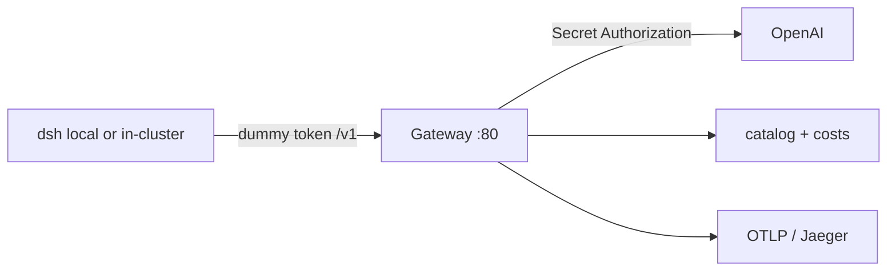

# Same thing on Kubernetes

Not the first pass. Standalone is the [README](../README.md) — that is what we actually ran.

This page is the **same pattern** on a cluster: DeepSeek Harness still talks OpenAI-compat with a dummy token. The real OpenAI key lives only in a Kubernetes Secret on the gateway. Cost catalog and traces stay on the gateway. Harness can stay on your laptop (port-forward) or run in-cluster against the gateway Service. MCP is the same later note — not wired.

I did not stand a cluster up for this repo. No fake screenshots. CRD names below are from the official agentgateway Kubernetes docs (1.4.x): `Secret`, `AgentgatewayBackend`, `HTTPRoute`, `AgentgatewayParameters`, `AgentgatewayPolicy`.

## Why

Same reasons as standalone. Key off the harness, off GitHub, off `$DSH_HOME`. One place for token stats, USD, and traces.



## Commands

Pin **v1.4.1** to match the box. Need a cluster, `kubectl`, and `helm`. Kind is enough:

```
kind create cluster
```

Gateway API + agentgateway CRDs + control plane:

```
export GWAPI_VERSION=1.6.0
kubectl apply --server-side --force-conflicts \
  -f https://github.com/kubernetes-sigs/gateway-api/releases/download/v$GWAPI_VERSION/standard-install.yaml

helm upgrade -i agentgateway-crds oci://cr.agentgateway.dev/charts/agentgateway-crds \
  --create-namespace --namespace agentgateway-system \
  --version v1.4.1

helm upgrade -i agentgateway oci://cr.agentgateway.dev/charts/agentgateway \
  --namespace agentgateway-system \
  --version v1.4.1 \
  --wait

kubectl get pods -n agentgateway-system
```

Key in a Secret. Typed from your shell, not from a file in git. Official field name is `Authorization`.

```
kubectl -n agentgateway-system create secret generic openai-secret \
  --from-literal=Authorization="$OPENAI_API_KEY"
```

Backend + route. Harness wants the OpenAI-compat `/v1` path.

```
kubectl apply -f- <<EOF
apiVersion: agentgateway.dev/v1alpha1
kind: AgentgatewayBackend
metadata:
  name: openai
  namespace: agentgateway-system
spec:
  ai:
    provider:
      openai: {}
  policies:
    auth:
      secretRef:
        name: openai-secret
    ai:
      routes:
        "/v1/chat/completions": "Completions"
        "/v1/models": "Models"
        "*": "Passthrough"
---
apiVersion: gateway.networking.k8s.io/v1
kind: HTTPRoute
metadata:
  name: openai
  namespace: agentgateway-system
spec:
  parentRefs:
    - name: agentgateway-proxy
      namespace: agentgateway-system
  rules:
    - matches:
        - path:
            type: PathPrefix
            value: /v1
      backendRefs:
        - name: openai
          group: agentgateway.dev
          kind: AgentgatewayBackend
EOF
```

Cost catalog: same `agctl` import as standalone, then a ConfigMap. Attach it with `AgentgatewayParameters` on the **Gateway** (`infrastructure.parametersRef`). Catalog on a GatewayClass is ignored.

```
agctl costs import --source models.dev --providers openai --out ./costs/catalog.json

kubectl -n agentgateway-system create configmap openai-costs \
  --from-file=catalog.json=./costs/catalog.json
```

```
kubectl apply -f- <<EOF
apiVersion: agentgateway.dev/v1alpha1
kind: AgentgatewayParameters
metadata:
  name: openai-costs
  namespace: agentgateway-system
spec:
  modelCatalog:
    sources:
      - configMap:
          name: openai-costs
          key: catalog.json
---
apiVersion: gateway.networking.k8s.io/v1
kind: Gateway
metadata:
  name: agentgateway-proxy
  namespace: agentgateway-system
spec:
  gatewayClassName: agentgateway
  infrastructure:
    parametersRef:
      name: openai-costs
      group: agentgateway.dev
      kind: AgentgatewayParameters
  listeners:
    - name: http
      port: 80
      protocol: HTTP
      allowedRoutes:
        namespaces:
          from: All
EOF
```

Tracing: Jaeger all-in-one again, then an `AgentgatewayPolicy` on the Gateway. Official field is `frontend.tracing` with a `backendRef`.

```
kubectl create namespace telemetry
kubectl apply -f- <<EOF
apiVersion: apps/v1
kind: Deployment
metadata:
  name: jaeger
  namespace: telemetry
spec:
  replicas: 1
  selector:
    matchLabels: { app: jaeger }
  template:
    metadata:
      labels: { app: jaeger }
    spec:
      containers:
        - name: jaeger
          image: jaegertracing/all-in-one:latest
          env:
            - name: COLLECTOR_OTLP_ENABLED
              value: "true"
          ports:
            - { containerPort: 16686, name: ui }
            - { containerPort: 4317, name: otlp-grpc }
---
apiVersion: v1
kind: Service
metadata:
  name: jaeger
  namespace: telemetry
spec:
  selector: { app: jaeger }
  ports:
    - { name: ui, port: 16686, targetPort: 16686 }
    - { name: otlp-grpc, port: 4317, targetPort: 4317 }
---
apiVersion: agentgateway.dev/v1alpha1
kind: AgentgatewayPolicy
metadata:
  name: tracing
  namespace: agentgateway-system
spec:
  targetRefs:
    - kind: Gateway
      name: agentgateway-proxy
      group: gateway.networking.k8s.io
  frontend:
    tracing:
      backendRef:
        name: jaeger
        namespace: telemetry
        port: 4317
      protocol: GRPC
      randomSampling: "true"
EOF
```

Local harness (what I would type first). Dummy token. Same `maxTokens` gotcha as standalone.

```
kubectl port-forward -n agentgateway-system deploy/agentgateway-proxy 8080:80
```

```
export GATEWAY_API_KEY=local-harness-not-openai
npx @deepseek-ai/dsh web
```

Custom provider `agw`, api `openai-completions`, baseURL `http://127.0.0.1:8080/v1`, `GATEWAY_API_KEY` = dummy, `maxTokens` **16384 or less**. Pick the `agw` model, not `deepseek-official`.

In-cluster harness is the same dummy token against `http://agentgateway-proxy.agentgateway-system.svc/v1`. I am not shipping a dsh Deployment here.

## Where to look

K8s ports are the controller defaults, not the standalone `14010` / `4002` we ran on the box.

```
kubectl port-forward -n agentgateway-system deploy/agentgateway-proxy 8080:80
kubectl port-forward -n agentgateway-system deploy/agentgateway-proxy 15000
kubectl port-forward -n telemetry deploy/jaeger 16686:16686
```

- Harness (local): http://127.0.0.1:3080
- OpenAI-compat: http://127.0.0.1:8080/v1
- Admin UI: http://127.0.0.1:15000/ui
- Jaeger: http://127.0.0.1:16686

## What this is not

No real API key in git. No Secret manifests in this repo. No cluster screenshots. MCP is not wired.
